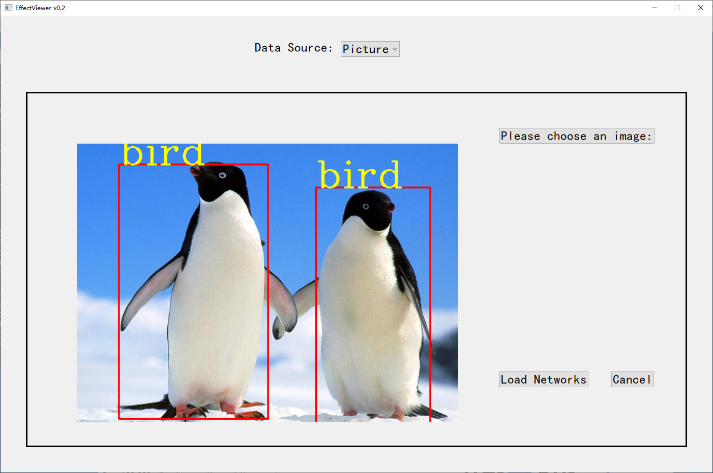

# Effect Viewer #

**Effect Viewer**是一个计算机视觉深度神经网络效果可视化GUI程序，其支持ONNX格式的神经网络文件。

Effect Viewer支持以下输入：
 - 本地图片(png/jpg格式)
 - 摄像头输入

Effect Viewer的使用：编译好之后点点点就行了。


## 效果演示 ##

采用[Yolo v4](https://arxiv.org/abs/2004.10934)网络进行目标检测。

## 编译过程 ##
### 安装依赖 ###
 - **[CMake](https://cmake.org/)** >= 3.2
 - **[Qt](https://download.qt.io/official_releases/qt/)** >= 5.9
 - **[Opencv](https://opencv.org/releases/)** >= 4.0
 - **[ONNX Runtime](https://github.com/Microsoft/onnxruntime)** >= 1.3

### 编译 ###
1. 设置CMakeLists.txt中各库的路径  
打开CMakeLists.txt，修改“# 设置路径”这一部分内容，其中：
    - `Qt5_DIR`是Qt5所在目录
    - `OpenCV_DIR`是Opencv所在目录
    - `ORT_INCLUDE_DIR`是ONNX Runtime的头文件目录
    - `ORT_LIB_DIR`是ONNX Runtime库文件所在目录
2. 在根目录中新建`build`文件夹并进入，命令行中输入：
    ```bash
    cmake ..
    cmake --build .
    ```
3. 将`onnxruntime.dll`和ONNX格式的神经网络(比如`yolov4.onnx`)拷贝到`build/Debug/`文件夹中。
4. 在`build/Debug/`文件夹中运行`EffectViewer`或`EffectViewer.exe`。

## To-do list: ##
 - 数据源中增加“视频”这一类型
 - 增加“类别生成器”模块，使其能够通过读取配置文件自动生成类文件
 - 任务类型(MissionType)添加对图片分类、风格迁移等类型任务的支持
 - 语言国际化
 - 增加更多模型